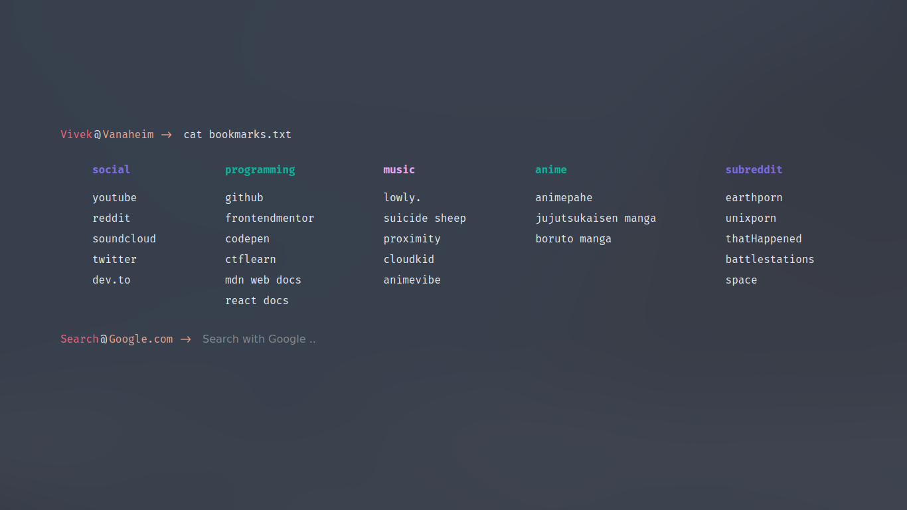

# Ecdysis

A Minimal, Custom Start Page For Browser

### To-Do

- [x] Google Search
- [ ] Custom Themes
- [ ] Bookmarks Manager
- [ ] Spotify Integration (Possibly!)

### How To Use?

You can use the startpage in two ways:

- Fork the repository, edit the code then host using free deployment platform such as Vercel. You can use the link of the deployed version as a custom page for your browser.
- You can use the repository as a Google Chrome or Brave browser extension. Edit the code then in the extensions menu, enable developer mode. Then click on load unpacked and select the repository.

